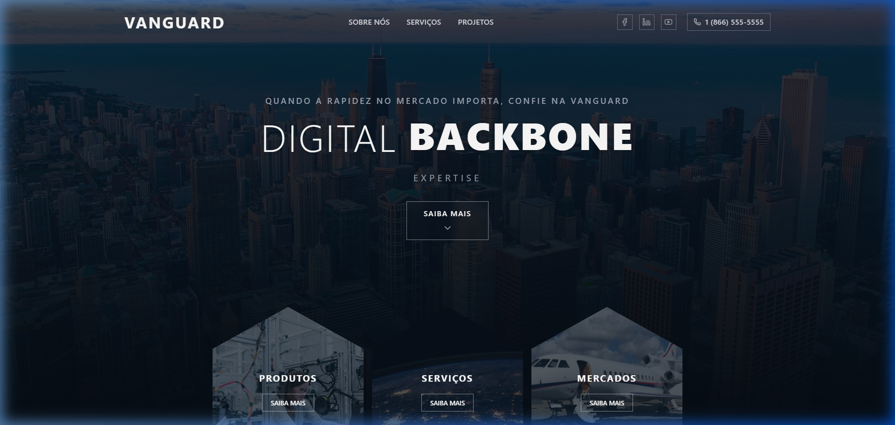

# Vanguard Landing Page Clone

Uma recriação moderna, responsiva e interativa da landing page da empresa Vanguard. Focada em performance e animações fluidas, essa interface foi construída para demonstrar práticas avançadas de UI/UX em desenvolvimento web.

## 🚀 Tecnologias Utilizadas

- **[React](https://reactjs.org/) + [Vite](https://vitejs.dev/)**: Para uma base rápida e modular.
- **[Tailwind CSS v4](https://tailwindcss.com/)**: Para estilização utilitária e design responsivo.
- **[Framer Motion](https://www.framer.com/motion/)**: Para orquestrar as animações de entrada e os textos rotativos dinâmicos.
- **[Lucide React](https://lucide.dev/)**: Para ícones leves e consistentes.

## ✨ Destaques do Projeto

- **Hero Section Dinâmica**: Título com um componente de texto rotativo animado (`RotatingText`), criando grande impacto visual assim que o usuário acessa o site.
- **Grid de Hexágonos**: Layout customizado e estilizado com recortes geométricos (`clip-path`), com efeitos de hover complexos e responsividade para dispositivos móveis.
- **Glassmorphism**: Uso de fundos translúcidos (`backdrop-blur`) no Footer e botões para garantir uma estética premium e moderna.
- **Totalmente Responsivo**: O layout se adapta perfeitamente em telas pequenas (smartphones), médias (tablets) e grandes (desktops).

